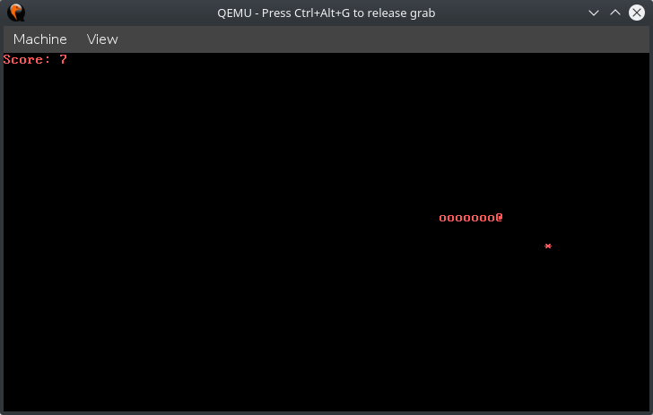

## asm_snake
asm_snake is a small snake game written in x86 assembly.

It is a small (less than 512 bytes) 16bit program which runs in real mode 
directly from the bootsector of a drive. It utilizes various BIOS functions. 
The program has added padding to the end, so the last two bytes of the 512byte 
binary are 0x55 0xAA (a valid boot sector signature).

To build the program, you will need nasm installed.

*Building on linux*
~~~
make
~~~

To run the program, you will need to store it on a drive, or use qemu as an emulator.

*Running using qemu*
~~~
make run
~~~

*WARNING: if you don't know those commands, dont perform them*

*storing it on usb at /dev/sdb*
~~~
make
sudo dd if=snake.bin of=/dev/sdb count=1 bs=512
~~~

## Screenshot of the program running in qemu

